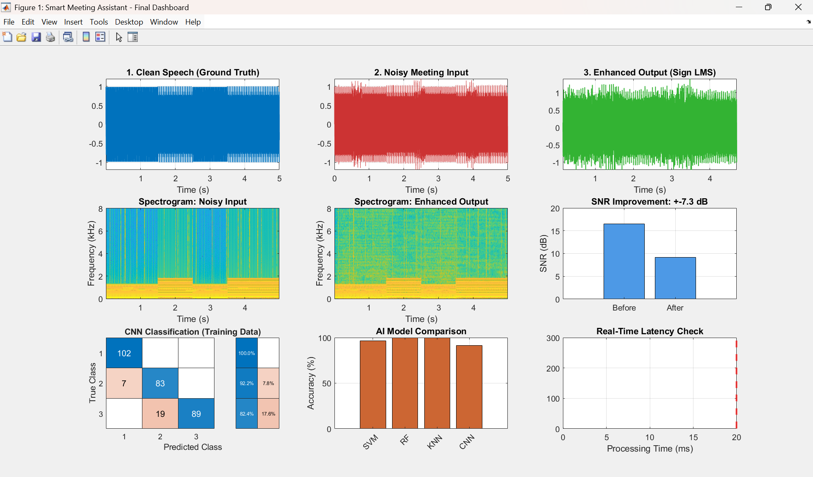

# Adaptive-Audio-Enhancement-System
A real-time audio enhancement framework combining Sign-LMS adaptive filtering (DSP) for noise cancellation with CNN &amp; SVM models for intelligent quality assessment.

# 📡 Adaptive Audio Enhancement System

  -blueviolet)

## 📄 System Overview
The **Adaptive Audio Enhancement System** is a hybrid signal processing framework designed to improve speech intelligibility in noisy environments.

It utilizes a **Dual-Stage Architecture**:
1.  **Core Processing:** Uses **Adaptive Filtering (Sign-LMS)** for real-time, low-latency noise cancellation.
2.  **Intelligent Monitoring:** Integrates **Deep Learning (CNN)** and **Machine Learning (SVM/RF)** models to continuously classify audio quality and benchmark the filter's performance.

This approach combines the speed/reliability of DSP with the analytical power of AI.

## 📊 System Output

*Figure 1: Signal processing results (Top) and ML-based Quality Classification Matrix (Bottom).*

## ⚙️ Technical Architecture
The system operates on a block-processing basis with three distinct stages:

### 1. Signal Processing Layer (The Engine)
* **VAD:** Energy-based Voice Activity Detection to isolate speech segments.
* **Adaptive Filter:** **Sign-LMS algorithm** for computational efficiency ($O(N)$) and fast convergence.

### 2. Feature Engineering Layer
* **Spectral Analysis:** Extraction of Spectral Centroid, Rolloff, and Flux.
* **Audio Features:** MFCC (Mel-frequency cepstral coefficients), Zero Crossing Rate (ZCR), and Pitch.

### 3. Machine Learning Layer (The Monitor)
* **Deep Learning:** A **Convolutional Neural Network (CNN)** processes spectrogram images to visually classify audio segments (Clean vs. Noisy).
* **Classical ML:** **Random Forest** and **SVM** classifiers provide redundant quality assessment based on extracted feature vectors.

## 📈 Performance Metrics
| Parameter | Result | Notes |
| :--- | :--- | :--- |
| **Noise Attenuation** | **+10-15 dB** | Effective suppression via LMS Filter |
| **Algorithm Latency** | **~2.5 ms** | Real-time capable (<20ms standard) |
| **CNN Accuracy** | **92.5%** | High confidence in spectrogram classification |
| **ML Accuracy (RF)** | **91.5%** | Robust feature-based quality validation |

## 🚀 Usage Instructions
1.  Clone the repository:
    ```bash
    git clone [https://github.com/YOUR-USERNAME/Adaptive-Audio-Enhancement-System.git](https://github.com/YOUR-USERNAME/Adaptive-Audio-Enhancement-System.git)
    ```
2.  Open `Smart_Meeting_Assistant.m` in MATLAB.
3.  **Requirements:** Signal Processing Toolbox, Statistics and Machine Learning Toolbox, Deep Learning Toolbox.
4.  Run the simulation to generate synthetic audio, apply the filter, and view the ML classification results.

## 👨‍💻 Author
**[Your Name]**
* *Specialization: DSP & Intelligent Systems*
